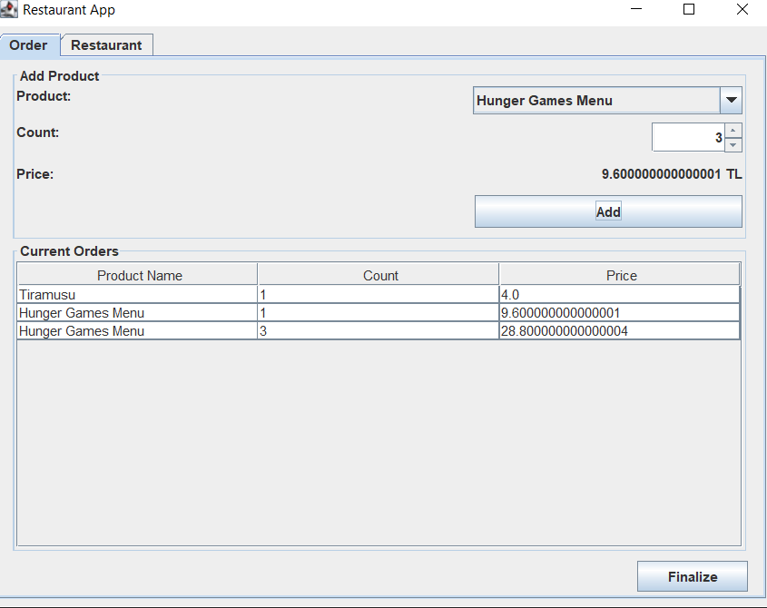
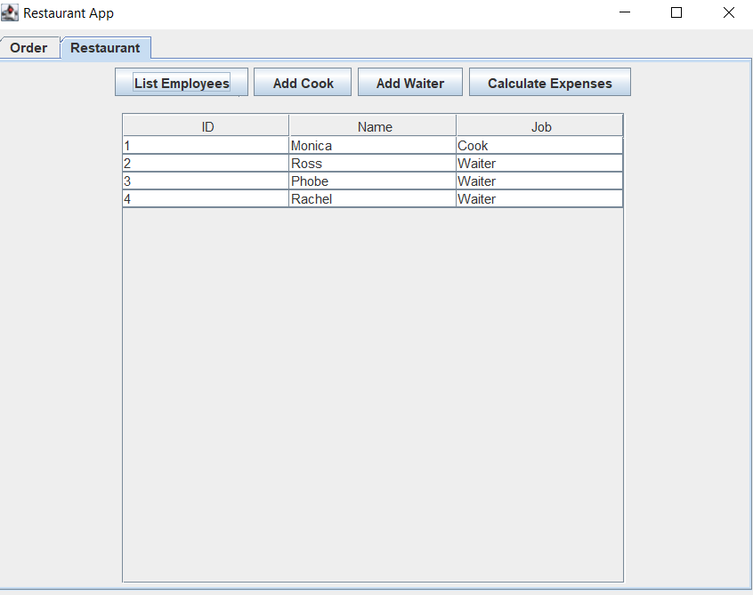

# Restaurant_App
Java restaurant app with swing GUI

There is a panel which have order and restaurant tab. 

If you click new order button, there is a panel for creating order. 
First of all, program assign a waiter to the customer and each waiter store their individual order.

Then you can select product which one you want to eat. 
The price tag shows a unit price. 
If you click add button, your product is added to the Current Orders table and you can see all of your product which you chose.

Then, if you click finalize button, your order is created.

When your order is completed, you are going to return your beginning screen. 
If you click Restaurant tab, you will see 4 button 
First one is List Employees Button. 
If you clicked it, you will see employees table. 

If you click, Add Cook button you can add cook to the your employee list 

If you click, Add Waiter button you can add waiter to the your employee list 

Last one is Calculate Expenses button and if you clicked it, this panel calculates all financial data ,such as employees salary, cook utility price and so on.

